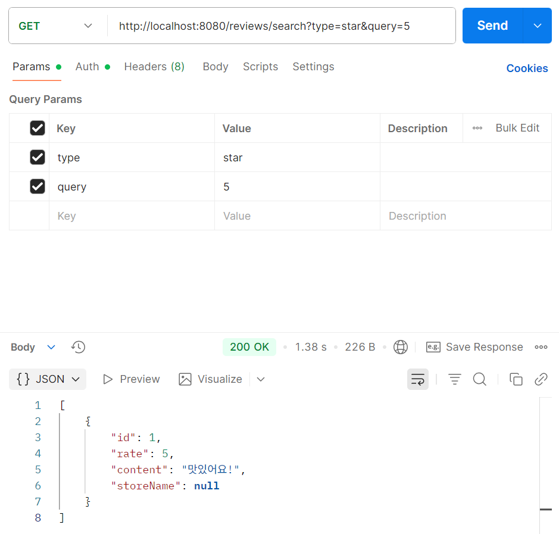
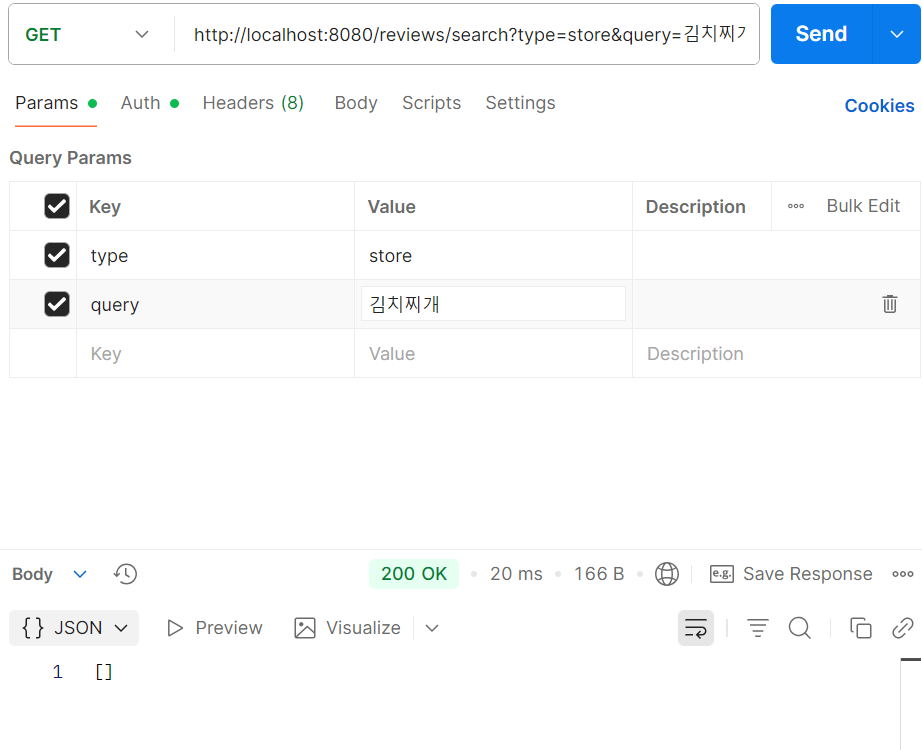

# 6주차 미션 queryDsl

  ## 최종 응답 구조

    ```java
        @Override
        public List<ReviewDto> searchReview(
                Predicate predicate
        ){
            JPAQueryFactory queryFactory = new JPAQueryFactory(em);
    
            QReview review = QReview.review;
            QStore store = QStore.store;
    
            return queryFactory
                    .select(com.querydsl.core.types.Projections.constructor(
                            ReviewDto.class,
                            review.id,
                            review.rate,
                            review.content,
                            store.name
                    ))
                    .from(review)
                    .leftJoin(review.store,store)
                    .where(predicate)
                    .fetch();
        }
    }
    ```

  시연
- rate는 되는데 store가 안됨..

    
    

  ## 오류
    - review를 반환해야 하는데 일부 필드만 가져옴 : getter를 안 적어서

        ```json
        [
            {
                "created_at": "2025-11-11T20:04:48",
                "updated_at": "2025-11-11T20:04:48"
            },
            {
                "created_at": "2025-11-11T20:04:48",
                "updated_at": "2025-11-11T20:04:48"
            }
        ]
    ### fetch 오류
  - fetch로 해야 되는데 store과 관련된 외래 키 가 fetch Type이 lazy 여서 발생

              ```markdown
              ERROR 18784 --- [umc9th] [nio-8080-exec-1] o.a.c.c.C.[.[.[/].[dispatcherServlet]    : Servlet.service() for servlet [dispatcherServlet] in context with path [] threw exception [Request processing failed: org.springframework.http.converter.HttpMessageConversionException: Type definition error: [simple type, class org.hibernate.proxy.pojo.bytebuddy.ByteBuddyInterceptor]] with root cause
              ```

              ```java
              com.fasterxml.jackson.databind.exc.InvalidDefinitionException: No serializer found for class org.hibernate.proxy.pojo.bytebuddy.ByteBuddyInterceptor and no properties discovered to create BeanSerializer (to avoid exception, disable SerializationFeature.FAIL_ON_EMPTY_BEANS) (through reference chain: java.util.ArrayList[0]->com.example.umc9th.domain.review.entity.Review["store"]->com.example.umc9th.domain.store.entity.Store$HibernateProxy["region"]->com.example.umc9th.domain.store.entity.Region$HibernateProxy["hibernateLazyInitializer"])
              ```
  - DTO로 받기
    1. reviewDto를 따로 만들어서 반환하도록 함 
### 기타 오류들
    1. Repo 작성할 때 join column 빠뜨린 이슈
    2. from 절을 빼먹은 이슈